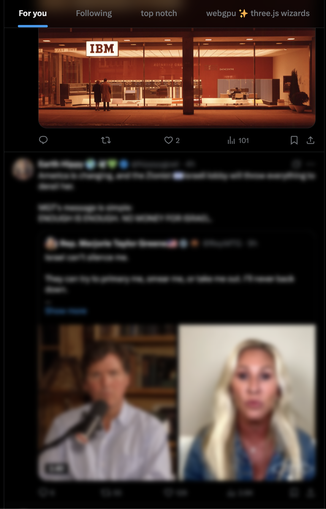
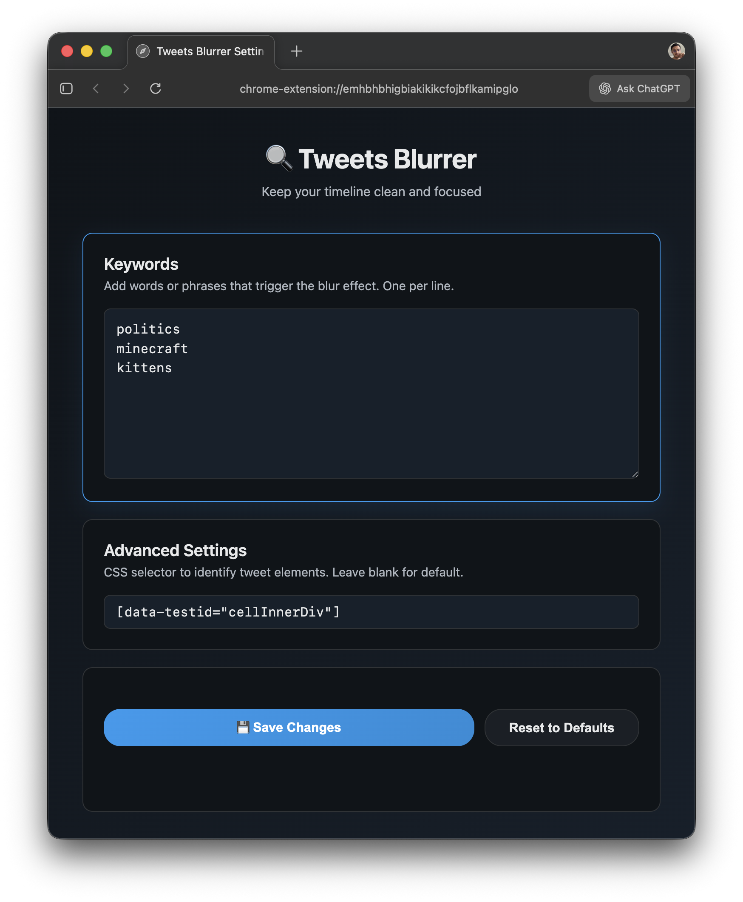

# 🔍 Tweets Blurrer

A Chrome extension that automatically blurs tweets containing political keywords on X.com and Twitter, helping you maintain focus on your timeline.



## Features

✨ **Smart Content Detection** - Automatically detects and blurs tweets with political keywords
🎯 **Hover to Reveal** - Blur effect lifts on hover if you want to read the content
⚙️ **Customizable Keywords** - Add your own words or phrases to trigger the blur
🔧 **Advanced Settings** - Customize CSS selectors for different Twitter/X layouts
🌓 **Dark Mode Support** - Beautiful settings page that respects your system theme
⚡ **Lightweight** - Minimal performance impact on your browsing

## Installation

### From Source (Development)

1. Clone or download this repository
2. Install dependencies:
   ```bash
   pnpm install
   ```
3. Build the extension:
   ```bash
   pnpm run build
   ```
4. Open Chrome and go to `chrome://extensions/`
5. Enable **Developer mode** (top-right corner)
6. Click **Load unpacked** and select the project folder

### Pre-built (No Build Required)

Simply load the extension from the project folder - the `dist/` directory already contains compiled files ready to use.

## Usage

1. **Install** the extension
2. **Customize** political keywords in the extension settings:
   - Right-click the extension icon → Options
   - Add words or phrases (one per line)
   - Click "Save Changes"
3. **Browse** normally - tweets with your keywords will be blurred
4. **Hover** over a blurred tweet to see the content temporarily

## Settings

### Settings Page

The settings page opens automatically after installation and has a modern, dark-themed interface:



### Political Keywords

Add the words or phrases that should trigger the blur effect. Examples:
- `politics`
- `election`
- `campaign`
- `partisan`

### Advanced Settings

For advanced users, you can customize the CSS selector used to identify tweet elements:
- Default: `[data-testid="cellInnerDiv"]`
- Leave blank to use the default

## Development

### Project Structure

```
src/                      # TypeScript source files
├── shared.ts            # Shared constants and utilities
├── options.ts           # Settings page logic
├── content.ts           # Content script (main functionality)
├── options.html         # Settings UI
└── style.css            # Styling

dist/                     # Compiled JavaScript (ready to use)
```

### Build Commands

```bash
pnpm run build          # Compile TypeScript → JavaScript
pnpm run watch         # Auto-compile on file changes
pnpm install           # Install dependencies
```

### Tech Stack

- **TypeScript** - Type-safe JavaScript
- **esbuild** - Fast bundler and compiler
- **Chrome APIs** - Storage, content scripts, manifest v3

## How It Works

1. **Content Script** runs on X.com and Twitter.com pages
2. **Monitors** the DOM for new tweets using MutationObserver
3. **Extracts** text from tweet elements
4. **Checks** if any configured keywords are present
5. **Applies** blur filter with CSS class if keywords match
6. **Hover** removes blur temporarily to reveal content

## Customization

### Change Blur Effect

Edit `src/style.css`:
```css
.blurred-tweet {
    filter: blur(4px) !important;  /* Adjust blur amount */
}
```

### Add More Features

1. Edit files in `src/`
2. Run `pnpm run build`
3. Reload extension in Chrome (`chrome://extensions/`)

## Privacy

- **No data collection** - Everything runs locally
- **No external requests** - All processing happens in your browser
- **No tracking** - Your keyword list stays on your device

## Known Limitations

- Only works on X.com and Twitter.com
- Requires page reload after changing keywords
- May not work with future Twitter layout changes

## Contributing

Issues and suggestions welcome! This is a personal project, but feel free to fork and customize for your needs.

## License

MIT - Use freely!

---

**v1.2.0** • Made with ❤️ for a cleaner timeline
