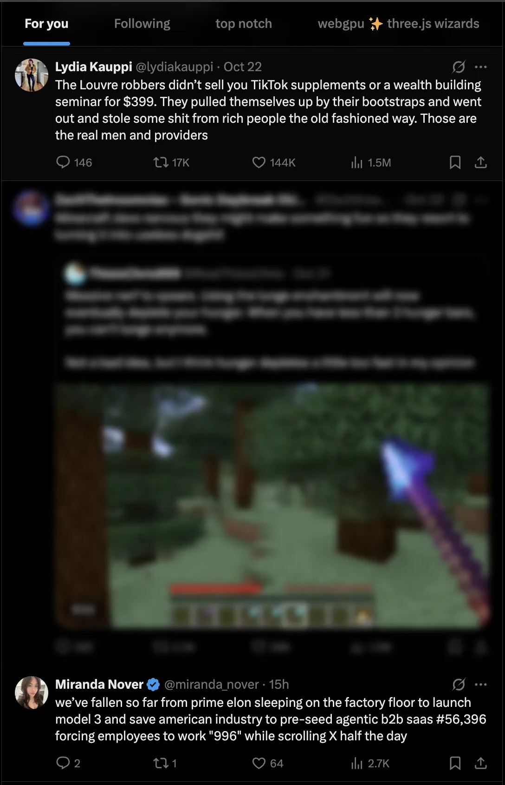
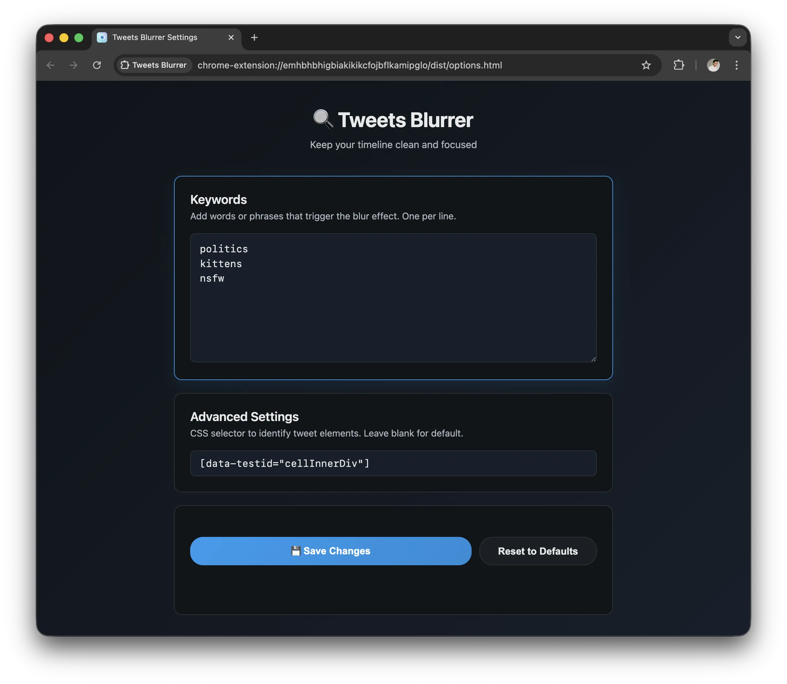

# 🔍 Tweets Blurrer

Automatically blur tweets with political keywords on X.com and Twitter. Opens settings automatically on install.

<div align="center">
  <table>
    <tr>
      <td width="50%" align="center">
        <br><br>
        <b>Blur in action</b>
      </td>
      <td width="50%" align="center">
        <br><br>
        <b>Settings</b>
      </td>
    </tr>
  </table>
</div>

## Quick Start

1. **Load Extension**: Go to `chrome://extensions/` → Enable "Developer mode" → Click "Load unpacked" and select this folder
2. **Configure**: Extension opens settings automatically - add your keywords
3. **Done**: Tweets with your keywords are blurred. Hover to reveal.

## Features

- ✨ Auto-blur tweets with configurable keywords
- 🎯 Hover to reveal content
- ⚙️ Customize CSS selectors

## Settings

**Keywords**: Add words/phrases (one per line) to trigger blur
**Advanced**: Customize tweet selector (default: `[data-testid="cellInnerDiv"]`)

## Development

```bash
pnpm install          # Install dependencies
pnpm run build        # Compile TypeScript → dist/
pnpm run watch        # Watch mode
```

**Stack**: TypeScript • esbuild • Manifest V3

## How It Works

- Content script monitors DOM for new tweets
- Extracts text and checks for keywords
- Applies blur CSS if keywords match
- Hover removes blur temporarily

## Privacy

Everything runs locally - no data collection, no external requests, no tracking.

## License

MIT - Fork and customize freely!

---

**v1.0.0** • Made with ❤️ by [@vladmdgolam](https://twitter.com/vladmdgolam)
